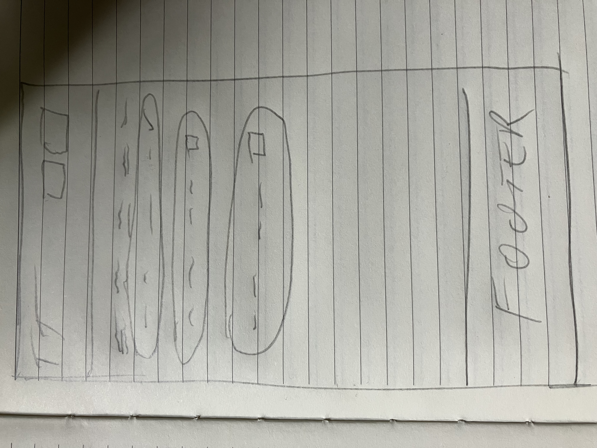

# Task Tracker Front-End

This is the front-end React application for the **Task Tracker** project, built as part of the Advanced Front-End Portfolio Project for the Code Institute Full-Stack Software Development diploma.

[Back-End Repository](https://github.com/itjosephk2/task-tracker-drf)

---

## Table of Contents

- [Project Purpose](#project-purpose)
- [Live Site](#live-site)
- [Technologies Used](#technologies-used)
- [Features](#features)
- [UX Design Process & Layout](#ux-design-process--layout)
  - [Design Process](#design-process)
  - [Navigation](#navigation)
  - [Task Table](#task-table)
  - [Task Creation](#task-creation)
  - [Responsive Design](#responsive-design)
  - [Accessibility](#accessibility)
  - [Visual Theme](#visual-theme)
  - [From Wireframes to Final UI](#from-wireframes-to-final-ui)
- [Manual Testing](#manual-testing)
- [Deployment](#deployment)
- [File Structure](#file-structure)
- [Testing](#testing)
- [Future Enhancements](#future-enhancements)
- [Role of Front-End Developers in Decoupled Applications](#role-of-front-end-developers-in-decoupled-applications)
- [Acknowledgements](#acknowledgements)

---

## Project Purpose

Task Tracker is a productivity application that allows users to:

- Register and log in securely.
- View, create, update, and delete tasks.
- Mark tasks as completed.
- Access a fully responsive, accessible UI built with React and Bootstrap.

---

## Live Site

- Frontend: [Heroku Frontend App](https://task-traker-react-494a1f4ec4cd.herokuapp.com/)
- Backend API: [Heroku API](https://task-tracker-drf-e7e43a44f5b5.herokuapp.com/api/)

---

##  Technologies Used

- React.js
- React Router
- Axios
- Bootstrap 5
- Django REST Framework (Back-End)
- Heroku (Deployment)

---

## Features

- **Authentication**: User signup, login, and logout.
- **Task Management (CRUD)**:
- Create a task with title, description, and due date.
- Read/view task details.
- Update tasks using an edit form.
- Delete tasks with confirmation.
- Mark task as completed using a PATCH request.
- **Routing**: Protected routes based on login state.
- **Feedback**: Alerts and validation for form errors and success.
- **Responsive Design**: Mobile-friendly and accessible.
- **UX Enhancements**: Loading indicators, navigation feedback.

---

## UX Design Process & Layout

The UX design for the Task Tracker frontend was planned prior to development to ensure a clear, intuitive, and responsive user experience. The design process included early wireframes, layout planning, and a strong focus on usability principles such as clarity, accessibility, and mobile responsiveness.

### Design Process

Before coding began, low-fidelity wireframes were created to define the core structure and user flow of the application. These wireframes guided the layout of key components such as the navigation bar, task list, and task creation interface. They ensured the UI would be both functional and visually clean across devices.

The design focused on:
- Presenting tasks in a readable, table-based format
- Making the most important actions (like creating or marking tasks as done) immediately visible
- Ensuring users could easily log in/out and navigate with minimal effort

Wireframes and visual diagrams were used throughout the process to validate layout decisions and ensure consistency from design to deployment.

> *Wireframe Example: Homepage Task View*  
> 

### Navigation

- A fixed top navigation bar includes the app title, a "Tasks" button, and a "Logout" button.
- Persistent navigation ensures users can easily move through the app without confusion.

### Task Table

- Tasks are displayed in a responsive table format with the following columns: **Title**, **Description**, **Due Date**, **Status**, and a **Done checkbox**.
- Color-coded badges and checkboxes provide quick visual indicators of task completion.

### Task Creation

- A prominent "Create Task" button is placed near the top-right of the task list, following common UI patterns for action placement.

### Responsive Design

- Built using Bootstrap's responsive grid and utility classes.
- Layout adjusts cleanly across mobile, tablet, and desktop screen sizes.

### Accessibility

- Forms use appropriate labels and validation.
- Keyboard navigability and strong color contrast were considered to support accessibility.

### Visual Theme

- A clean dark-mode inspired theme helps reduce eye strain and makes key UI elements pop.
- Green is used for completed tasks, yellow for pending, and blue for primary actions — offering clear visual feedback without overwhelming the user.

---

### From Wireframes to Final UI

All core design elements proposed in the original wireframes were implemented in the final application. The structure, layout, and interaction flow were preserved, and decisions were continuously validated through manual testing to ensure the UI aligned with user expectations.

This structured approach demonstrates a full UX design process — from planning, diagramming, and wireframing to final implementation and deployment.


---

##  Manual Testing

Manual testing has been completed for the following:

- Navigation works as expected (Login → Home → View → Edit).
- Login/Logout functionality updates state correctly.
- Form validation triggers on empty submissions.
- All CRUD operations provide expected feedback.
- Invalid actions (e.g., editing another user's task) are blocked via API.
- API data is correctly rendered and updated.

Test cases and results are documented in the [Testing Section](#testing).

---

## Deployment

Deployed using Heroku:

Frontend deployed with static build via Heroku (Node.js buildpack).

## Deployment (Heroku)

1. Create Heroku app:
```bash
heroku create your-app-name
```

2. Deploy to Heroku:
```bash
git push heroku main
```

REACT_APP_API_BASE_URL=https://task-tracker-drf-e7e43a44f5b5.herokuapp.com/api/

---

## File Structure

- `src/components/`: All modular React components (Login, Signup, Home, Tasks).
- `src/api.js`: Central location for API URL and auth header helper.
- `src/App.js`: Route manager using React Router v6.
- `src/index.js`: App entry point.

---

## Testing

| Feature Tested          | Result |
|-------------------------|--------|
| Login/Logout Flow       | ✅ Pass |
| Register New User       | ✅ Pass |
| Create Task             | ✅ Pass |
| Edit Task               | ✅ Pass |
| Delete Task             | ✅ Pass |
| Mark as Completed       | ✅ Pass |
| Navigation/Routes       | ✅ Pass |
| Responsive Design       | ✅ Pass |

---

## Future Enhancements

- Filter/sort tasks by due date and completion.
- Create task list groups and priority
- Follow Users and make tasks list groups private or public

---

## Role of Front-End Developers in Decoupled Applications

In modern software development, front-end developers play a crucial role in **building decoupled applications**, where the user interface (UI) is separated from the backend logic. This approach allows teams to work independently on different parts of the application, accelerating development and improving scalability.

Specialist front-end developers are responsible for:
- Designing and implementing dynamic, responsive, and accessible user interfaces.
- Consuming APIs provided by the backend to display and manipulate data.
- Managing state, routing, and client-side validation to provide a seamless user experience.
- Collaborating with UX/UI designers and backend engineers to ensure functional and aesthetic consistency.

In this project, the React frontend is fully decoupled from the Django REST backend. The frontend interacts with the API via HTTP requests, making the system more modular and easier to maintain or scale in the future.


---

## Acknowledgements

Thanks to Code Institute and the React/Django DRF communities for the walkthroughs, guidance, and support throughout this journey.
