# Task Tracker Front-End

> 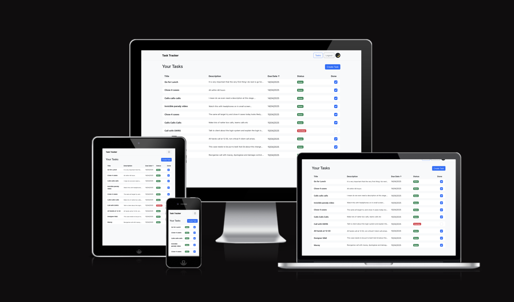

This is the front-end React application for the **Task Tracker** project, built as part of the Advanced Front-End Portfolio Project for the Code Institute Full-Stack Software Development diploma.

[Back-End Repository](https://github.com/itjosephk2/task-tracker-drf)

---

## Table of Contents

-    [Project Purpose](#project-purpose)
-    [Live Site](#live-site)
-    [Technologies Used](#technologies-used)
-    [Features](#features)
     -    [Landing Page](#landing-page)
     -    [Login Page](#login-page)
     -    [Signup Page](#signup-page)
     -    [Task List Page](#task-list-page)
     -    [Task View Page](#task-view-page)
     -    [Task Create Page](#task-create-page)
     -    [Task Edit Page](#task-edit-page)
     -    [Extra Features](#extra-features)
-    [Agile Development Process](#agile-development-process)
-    [UX Design Process & Layout](#ux-design-process--layout)
     -    [Design Process](#design-process)
     -    [Navigation](#navigation)
     -    [Task Table](#task-table)
     -    [Task Creation](#task-creation)
     -    [Responsive Design](#responsive-design)
     -    [Accessibility](#accessibility)
     -    [Visual Theme](#visual-theme)
     -    [From Wireframes to Final UI](#from-wireframes-to-final-ui)
-    [Manual Testing](#manual-testing)
-    [Deployment](#deployment)
-    [File Structure](#file-structure)
-    [Testing](#testing)
-    [Future Enhancements](#future-enhancements)
-    [Role of Front-End Developers in Decoupled Applications](#role-of-front-end-developers-in-decoupled-applications)
-    [Acknowledgements](#acknowledgements)

---

## Project Purpose

Task Tracker is a productivity application that allows users to:

-    Register and log in securely.
-    View, create, update, and delete tasks.
-    Mark tasks as completed.
-    Access a fully responsive, accessible UI built with React and Bootstrap.

---

## Live Site

-    Frontend: [Heroku Frontend App](https://task-traker-react-494a1f4ec4cd.herokuapp.com/)
-    Backend API: [Heroku API](https://task-tracker-drf-e7e43a44f5b5.herokuapp.com/api/)

---

## Technologies Used

-    React.js
-    React Router
-    Axios
-    Bootstrap 5
-    Django REST Framework (Back-End)
-    Heroku (Deployment)

---

## Features

### Landing Page

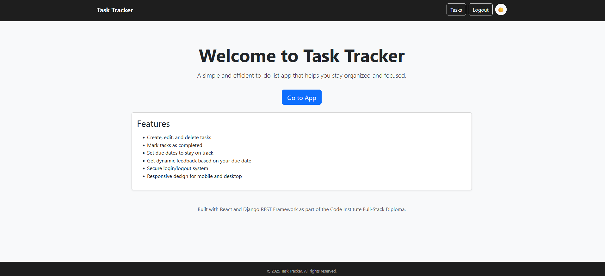

#### Description

The landing page just functions as a brief description of the application and a cta to the app.

#### Planned Improvements

-    [ ] I would like to design a more thourough page.
-    [ ] I would like to redesign the layout.
-    [ ] I Would like to seperate the landing page from the app in regards to the navigation bar.

### Login Page

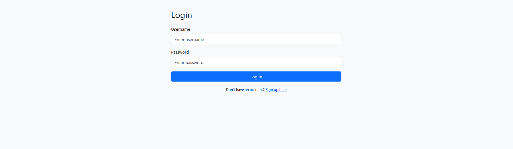

#### Description

The Login Page is a simple layout for signing in to the app

#### Planned Improvements

-    [ ] I would like to redesign the laout to a two section page with an image on the right side
-    [ ] I would like to brand the login page
-    [ ] I Would like to add a forgot your password section

### Signup Page

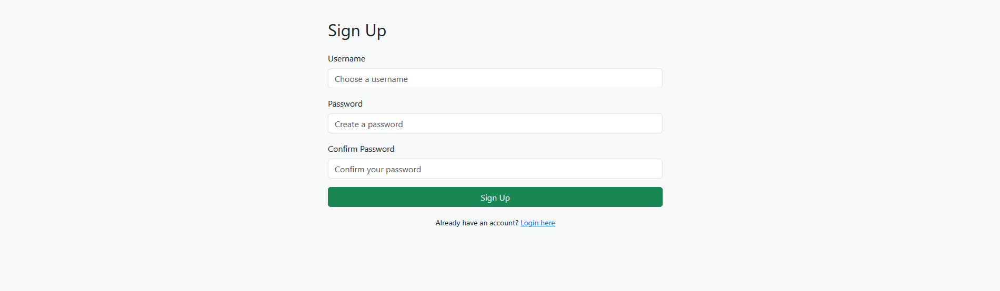

#### Description

The Signup Page is a simple layout for signing in to the app

#### Planned Improvements

-    [ ] I would like to redesign the laout to a two section page with an image on the right side
-    [ ] I would like to brand the Signup page

### Task List Page

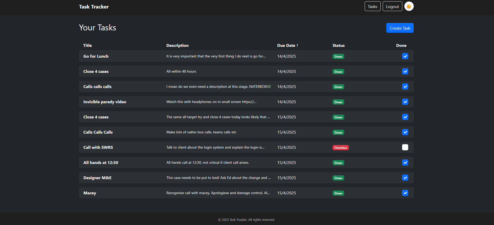

#### Description

The task list page is the main page of the app. It contains all the tasks listed down. There is fields which all can be ordered by. There is also a toggle check box to check the task as completed or not.

#### Planned Improvements

-    [ ] I would like to make the tasks draggable so you can manual sort them
-    [ ] I would like to add a folder system to store the tasks
-    [ ] I am thinking about a filter/search system for them

### Task List Page

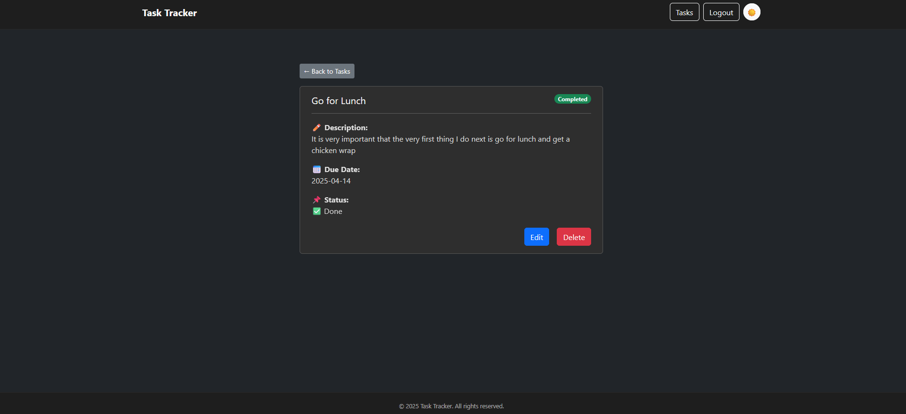

#### Description

The task View page allows the user to view the full details of the task. I think it is kind of fun with the emojis and on mobile it allows you to have a full breakdown of the task. A task can also be delted or edited from here.

#### Planned Improvements

-    [ ] I would like to make the task view draggable and maybe make it a pin board from a folder
-    [ ] I would like add custom features like riorities etc that can be managed here
-    [ ] I am thinking about creating board templates like kanban boards so when you come to here from a folder it can behave in the way you like e.g. kanban, pin board etc

### Task Create Page

#### Description

The task create page is where you can create a task. It has a simple form that is very mobile friendly. There is a toastify celebration message on succesul creation. The page stays there so you can create multiple tasks which I have found quite useful when using the app.

#### Planned Improvements

-    [ ] I would like to update the forms layout especially for larger devices
-    [ ] I would like to update the submit button.

### Task Edit Page

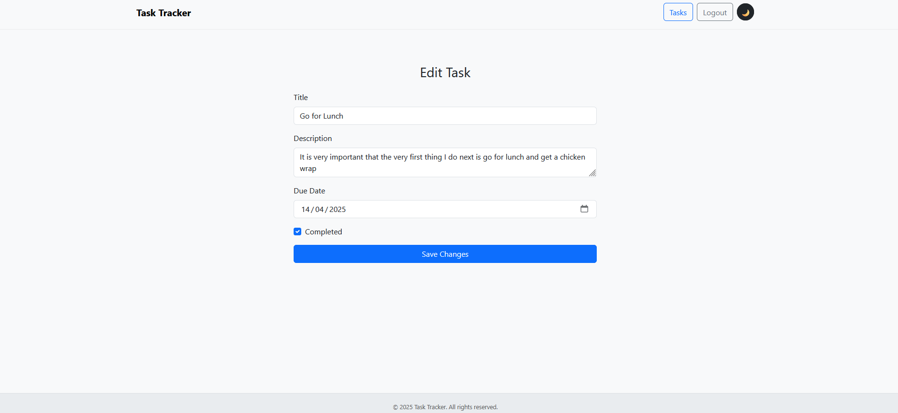

#### Description

The task edit page allows the user to update the fields within the task. This includes the title and description and due date. This also shows off a form in the light theme which is the deafult theme.

#### Planned Improvements

-    [ ] I would like to update the forms layout especially for larger devices
-    [ ] I would like to update the submit button.
-    [ ] I am thinking of adding a collaboration feature for teams etc and as a result locking down the edit feature to admins.

### Extra features

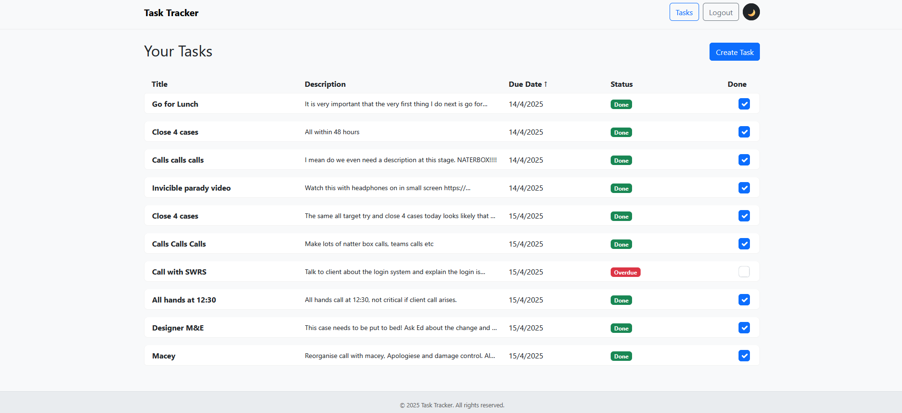
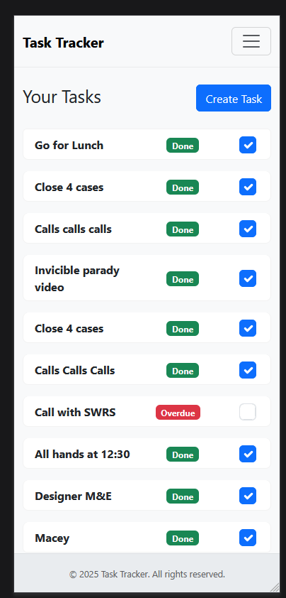

#### Description

The aboveshows the light theme which is the default theme although most images were taken in dark theme as that is my default.
There is also a design of the mobile task list where unneccesary features were removed to help fit the mobile device better, including order by. Which just sits at the default way of date.

#### Planned Improvements

-    [ ] I would like to add more themes or even custom themes
-    [ ] I would like to add order by on mobile but I would have to design a clean way that fits the app.
-    [ ] I would like to add a react native mobile app

---

## Agile Development Process

This project was developed using an Agile-inspired, iterative approach. Features were built incrementally and tested manually throughout each development cycle. Early wireframes and planning helped guide the initial structure, but refinements were made continuously based on feedback and testing.

Key aspects of Agile followed:

-    **Incremental development**: Core functionality (authentication, task management) was prioritized and implemented early.
-    **Continuous testing**: Manual testing was carried out during and after each feature to ensure a reliable user experience.
-    **Adaptability**: UI and UX decisions evolved based on what worked well in practice, not just in theory.
-    **Feature-focused sprints**: Each session focused on completing a feature end-to-end (e.g. task creation, editing, or deletion).

Although developed solo, this project emulates Agile workflows through iteration, responsiveness to change, and a focus on delivering working software at every stage.

View the [GitHub Project Kanban Board](https://github.com/users/itjosephk2/projects/16) used to manage feature progress and tasks.

--

## UX Design Process & Layout

The UX design for the Task Tracker frontend was planned prior to development to ensure a clear, intuitive, and responsive user experience. The design process included early wireframes, layout planning, and a strong focus on usability principles such as clarity, accessibility, and mobile responsiveness.

### Design Process

Before coding began, low-fidelity wireframes were created to define the core structure and user flow of the application. These wireframes guided the layout of key components such as the navigation bar, task list, and task creation interface. They ensured the UI would be both functional and visually clean across devices.

The design focused on:

-    Presenting tasks in a readable, table-based format
-    Making the most important actions (like creating or marking tasks as done) immediately visible
-    Ensuring users could easily log in/out and navigate with minimal effort

Wireframes and visual diagrams were used throughout the process to validate layout decisions and ensure consistency from design to deployment.

> _Wireframe Example: Homepage Task View_  
> 

### Navigation

-    A fixed top navigation bar includes the app title, a "Tasks" button, and a "Logout" button.
-    Persistent navigation ensures users can easily move through the app without confusion.

### Task Table

-    Tasks are displayed in a responsive table format with the following columns: **Title**, **Description**, **Due Date**, **Status**, and a **Done checkbox**.
-    Color-coded badges and checkboxes provide quick visual indicators of task completion.

### Task Creation

-    A prominent "Create Task" button is placed near the top-right of the task list, following common UI patterns for action placement.

### Responsive Design

-    Built using Bootstrap's responsive grid and utility classes.
-    Layout adjusts cleanly across mobile, tablet, and desktop screen sizes.

### Accessibility

-    Forms use appropriate labels and validation.
-    Keyboard navigability and strong color contrast were considered to support accessibility.

### Visual Theme

-    A clean dark-mode inspired theme helps reduce eye strain and makes key UI elements pop.
-    Green is used for completed tasks, yellow for pending, and blue for primary actions — offering clear visual feedback without overwhelming the user.

---

### From Wireframes to Final UI

All core design elements proposed in the original wireframes were implemented in the final application. The structure, layout, and interaction flow were preserved, and decisions were continuously validated through manual testing to ensure the UI aligned with user expectations.

This structured approach demonstrates a full UX design process — from planning, diagramming, and wireframing to final implementation and deployment.

---

## Manual Testing

Manual testing has been completed for the following:

-    Navigation works as expected (Login → Home → View → Edit).
-    Login/Logout functionality updates state correctly.
-    Form validation triggers on empty submissions.
-    All CRUD operations provide expected feedback.
-    Invalid actions (e.g., editing another user's task) are blocked via API.
-    API data is correctly rendered and updated.

Test cases and results are documented in the [Testing Section](#testing).

---

# Deployment To Heroku

The project was deployed to [Heroku](https://www.heroku.com). The deployment process is as follows:

Firstly we need to create a new repository in [GitHub](https://github.com/) where our project files will be located

- Navigate to [GitHub](https://github.com/)
- Create a new repository with no template

Once you've created your new empty repository, we need to pull this repository down onto our local machine. Throughout the course I have used [VSCode](https://code.visualstudio.com/) to create and manage my projects instead of GitPod so I will be demonstrating the process with [VSCode](https://code.visualstudio.com/).

- Copy either the HTTPS or SSH URL that has just been generated by [GitHub](https://github.com/)

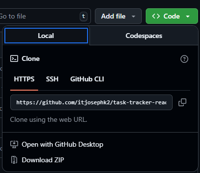

Now we need to open up a command prompt to pull this empty repository down onto our machine

- Open a CMD
- CD to a location you wish to store this project
- Now type **git clone https://github.com/itjosephk2/task-tracker-react.git**
- After the project has been pulled down onto your local machine, CD to the project and type **code .** to open the project with [VSCode](https://code.visualstudio.com/)

Now we need to initialize this project as a [React](https://reactjs.org/) project

- Open up a new [GitBash](<https://en.wikipedia.org/wiki/Bash_(Unix_shell)>) terminal within the project
- Type in **npx create-react-app . --use-npm**

This may take a few minutes, but when it is complete, you will see the below image

Once completed, you can test your new [React](https://reactjs.org/) application is working by typing **npm start** in the terminal

Now we can push our new project to our [GitHub](https://github.com/) repository

- **git add .**
- **git commit -m "Initial commit"**
- **git push**

Now it's time to deploy our new project live for everyone to see on [Heroku](https://www.heroku.com)

- Navigate to [Heroku](https://www.heroku.com)
- Click **New app**
- Fill in the relevant information
- Click **Create app** once you are happy

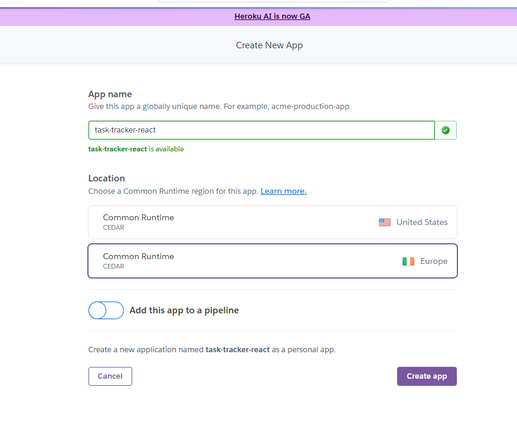

Now we need to link our [Heroku](https://www.heroku.com) application with our [GitHub](https://github.com/) project

- Click the **Deploy** tab
- Choose **GitHub**
- Search for your repository
- Once found, click **Connect**

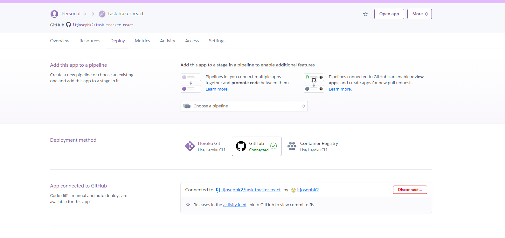

Finally, we can deploy our connected projected for everyone to see.

You can either choose **Enable Automatic Deploys** or **Deploy Branch**. I chose to deploy my application manually when I was ready instead of automatic deployments

- Click **Deploy Branch** and wait for it to build

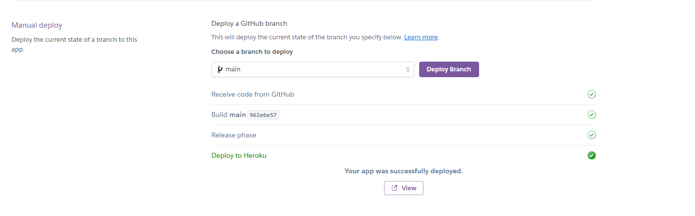

Your new [React](https://reactjs.org/) application is now successfully deployed to [Heroku](https://www.heroku.com)

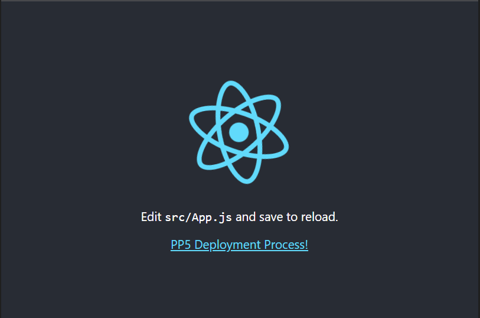

## File Structure

-    `src/components/`: All modular React components (Login, Signup, Home, Tasks).
-    `src/api.js`: Central location for API URL and auth header helper.
-    `src/App.js`: Route manager using React Router v6.
-    `src/index.js`: App entry point.

---

## Testing

| Feature Tested     | Description                                                  | Result  |
|--------------------|--------------------------------------------------------------|---------|
| Login/Logout Flow  | Ensures users can log in with valid credentials and log out  | ✅ Pass |
| Register New User  | Confirms a new user can register with valid data             | ✅ Pass |
| Create Task        | Tests ability to create a task with required fields          | ✅ Pass |
| Edit Task          | Validates full/partial updates to an existing task           | ✅ Pass |
| Delete Task        | Checks if a user can delete their own task                   | ✅ Pass |
| Mark as Completed  | Verifies task completion status can be toggled               | ✅ Pass |
| Navigation/Routes  | Confirms correct navigation between views/pages              | ✅ Pass |
| Responsive Design  | Ensures layout adapts properly across device sizes           | ✅ Pass |

---

## Future Enhancements

-    Filter/sort tasks by due date and completion.
-    Create task list groups and priority
-    Follow Users and make tasks list groups private or public

---

## Dependencies Used

This project includes a few key libraries beyond core React to enhance functionality, styling, and user experience:

-    **axios**  
     Used to make HTTP requests to your Django REST API. It simplifies GET, POST, PUT, and DELETE requests and handles things like headers and error responses more cleanly than `fetch`.

-    **bootstrap**  
     Provides a set of CSS styles and layout utilities to quickly build a responsive and consistent UI.

-    **react-bootstrap**  
     Allows you to use Bootstrap components (like buttons, modals, alerts) directly as React components, making styling easier and more React-friendly.

-    **react-router-dom**  
     Used to handle routing in your app — for navigating between pages like Home, Create Task, View Task, etc., without reloading the page.

-    **react-toastify**  
     Adds toast notifications to your app — for example, when a task is created, updated, or deleted, you can show success or error messages in a non-intrusive way.

---

## Role of Front-End Developers in Decoupled Applications

In modern software development, front-end developers play a crucial role in **building decoupled applications**, where the user interface (UI) is separated from the backend logic. This approach allows teams to work independently on different parts of the application, accelerating development and improving scalability.

Specialist front-end developers are responsible for:

-    Designing and implementing dynamic, responsive, and accessible user interfaces.
-    Consuming APIs provided by the backend to display and manipulate data.
-    Managing state, routing, and client-side validation to provide a seamless user experience.
-    Collaborating with UX/UI designers and backend engineers to ensure functional and aesthetic consistency.

In this project, the React frontend is fully decoupled from the Django REST backend. The frontend interacts with the API via HTTP requests, making the system more modular and easier to maintain or scale in the future.

---

## Acknowledgements

Thanks to Code Institute and the React/Django DRF communities for the walkthroughs, guidance, and support throughout this journey.
